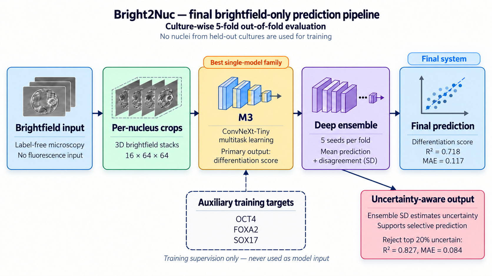
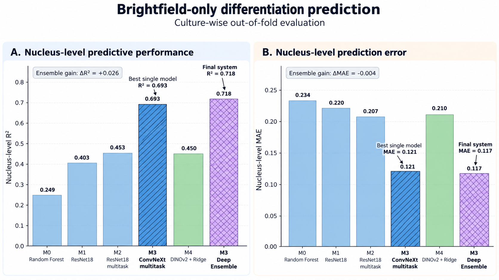
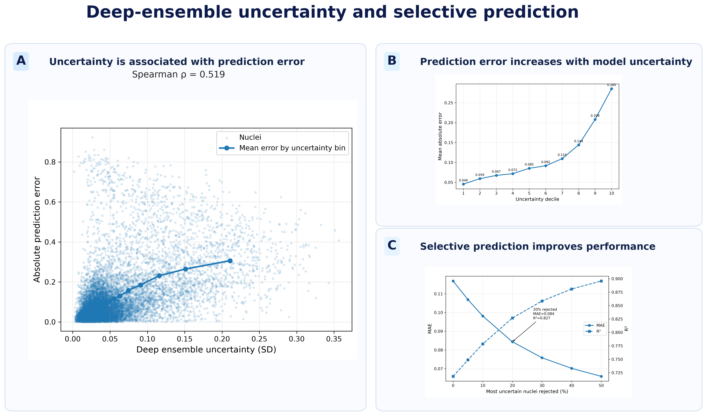
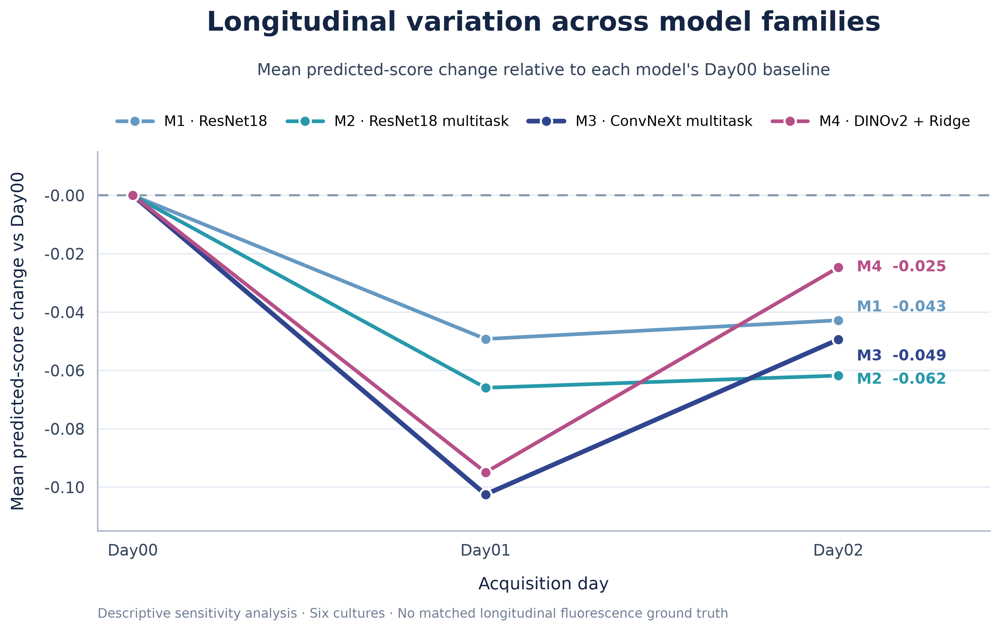
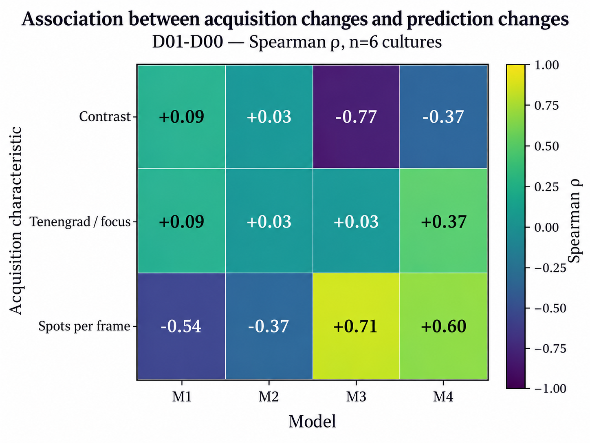

<div align="center">

# Bright2Nuc
### Label-Free Prediction of Differentiation State from Brightfield Microscopy

**Culture-wise evaluation · Multitask deep learning · Deep ensembles · Uncertainty-aware prediction**

[](https://www.python.org/)
[](https://pytorch.org/)
[](LICENSE)
[](#status)

**AI4S Open Innovation — Bright2Nuc label-free prediction task**

[Technical report](report/Bright2Nuc_Final_Report.pdf) ·
[Data instructions](data/README.md) ·
[Frozen results](results/) ·
[Model weights & inference](weights/README.md) ·
[Reproduction pipeline](#reproduction-pipeline)

</div>

---

This repository contains the reproducible experimental pipeline developed for the **Bright2Nuc / AI4S label-free prediction task**.

The objective is to predict a **per-nucleus differentiation label from brightfield microscopy only**. Fluorescence-derived information is used only as supervision during training or evaluation and is **never used as model input at inference time**.

<p align="center">
  
</p>

## At a glance

| Dataset | Evaluation | Best single model | Final ensemble | Uncertainty-aware subset |
|:--|:--|:--|:--|:--|
| **30,877 nuclei** · **48 cultures** | **5-fold culture-wise CV** | M3 ConvNeXt-Tiny · **R² 0.693** · **MAE 0.121** | 5-seed M3 ensemble · **R² 0.718** · **MAE 0.117** | Reject top 20% uncertain · **R² 0.827** · **MAE 0.084** |

The static benchmark uses a frozen five-fold culture-wise protocol: nuclei from held-out cultures are not used for training in the corresponding fold.

## Model families

| Model | Approach | Nucleus R² | Nucleus MAE | Culture R² | Culture MAE |
|---|---|---:|---:|---:|---:|
| **M0** | Random Forest on morphology + brightfield handcrafted features | 0.249 | 0.234 | 0.337 | 0.244 |
| **M1** | ImageNet-pretrained ResNet18 | 0.403 | 0.220 | 0.522 | 0.219 |
| **M2** | Multitask ResNet18 + OCT4 / FOXA2 / SOX17 supervision | 0.453 | 0.207 | 0.552 | 0.211 |
| **M3** | Multitask ConvNeXt-Tiny + OCT4 / FOXA2 / SOX17 supervision | **0.693** | **0.121** | **0.895** | **0.085** |
| **M4** | Frozen DINOv2 ViT-S representation + Ridge | 0.450 | 0.210 | 0.678 | 0.177 |
| **M3 ensemble** | Mean prediction across seeds 42–46 | **0.718** | **0.117** | **0.892** | **0.089** |

<p align="center">
  
</p>

M3 is the strongest individual model family. The final system uses the five-member M3 deep ensemble rather than selecting a single seed post hoc.

## Uncertainty-aware prediction

Predictive uncertainty is estimated from the **sample standard deviation across the five M3 ensemble members**.

Higher ensemble disagreement is associated with larger absolute prediction error (**Spearman ρ = 0.519**). Selective prediction improves performance on the retained nuclei as the most uncertain predictions are rejected.

<p align="center">
  
</p>

At a 20% rejection rate, the retained subset reaches approximately **R² = 0.827** and **MAE = 0.084**. These values apply only to the retained nuclei.

## Longitudinal sensitivity analysis

A separate analysis applies M1–M4 to longitudinal brightfield time-series from **six cultures over Day00, Day01 and Day02**, using a common support of **88,458 tracked observations**.

This is a **descriptive sensitivity analysis**, not longitudinal biological validation: matched longitudinal fluorescence ground truth is unavailable, and predicted-score trajectories may also reflect acquisition or image-quality effects.

<p align="center">
  
</p>

Acquisition-related changes were also compared with prediction changes as a descriptive confounder analysis:

<p align="center">
  
</p>

> **Interpretation note:** with only six longitudinal cultures, these correlations are descriptive and should not be interpreted as causal effects.

## What is included

- frozen culture-wise split definitions;
- data validation and preprocessing scripts;
- M0–M4 model pipelines;
- five-seed M3 deep-ensemble training and aggregation;
- uncertainty and abstention analysis;
- longitudinal sensitivity analysis;
- publication-ready figures;
- compact frozen result tables;
- a standalone technical report;
- pinned public environment specifications.

Large checkpoints, cached arrays, embeddings and intermediate predictions are intentionally excluded from version control.

---

## Repository structure

```text
.
├── .gitignore
├── CITATION.cff
├── LICENSE
├── LICENSE_SCOPE.md
├── THIRD_PARTY_NOTICES.md
├── README.md
├── environment.yml
├── requirements.txt
├── run_all.sh
├── data/
│   ├── README.md
│   ├── processed/
│   └── raw/
├── figures/
│   ├── final/
│   └── longitudinal/
├── outputs/
├── report/
│   ├── Bright2Nuc_Final_Report.pdf
│   └── figures/
│       ├── final_pipeline_publication.png
│       ├── final_model_comparison_publication.png
│       ├── final_uncertainty_publication.png
│       ├── longitudinal_delta_from_day00_m1_m4.png
│       └── longitudinal_confounders_D01_D00.png
├── results/
├── weights/
│   ├── README.md
│   └── SHA256SUMS.txt
└── scripts/
    ├── data/
    ├── demo/
    │   └── 80_predict_m3_fold_ensemble.py
    ├── evaluation/
    ├── figures/
    ├── longitudinal/
    └── models/
```

`outputs/` contains generated experiment artefacts and is intentionally excluded from version control.

The frozen culture-wise split definitions are stored under `data/processed/`.

Small frozen result tables are stored under `results/`, publication-ready scientific figures under `figures/`, and README/report presentation assets under `report/figures/`.

## Installation

The project was developed and validated under **WSL2 with Ubuntu 24.04** using an **NVIDIA RTX 4080**. The pipeline uses standard Linux paths and tools and can also be executed under native Linux.

The release was tested with:

- Python 3.11
- PyTorch 2.14.0 + CUDA 12.6
- torchvision 0.29.0 + CUDA 12.6
- timm 1.0.30
- OpenCV (opencv-python-headless) 5.0.0.93
- NVIDIA CUDA available through PyTorch

Create the environment with:

```bash
conda env create -f environment.yml
conda activate bright2nuc
pip install -r requirements.txt
```

The installation was validated from a clean Conda environment with CUDA successfully detected by PyTorch.

## Data

The dataset is not redistributed in this repository.

Original Bright2Nuc resources:

- Zenodo DOI: `10.5281/zenodo.7014598`
- Original repository: `https://github.com/marrlab/Bright2Nuc`

See [`data/README.md`](data/README.md) for the expected directory structure and generated intermediate files.

The static pipeline expects the transcription-factor prediction resources under:

```text
data/raw/TF_prediction/
├── Positions_Classes.csv
├── Features.csv
├── Features_Brightfield.csv
├── SingleNuclei/
├── SingleNucleiBF/
├── SingleNucleiTF/
└── Rawdata/
    └── TF/
```

For the longitudinal analysis, the extracted Bright2Nuc data root can be configured with:

```bash
export BRIGHT2NUC_DATA_ROOT="/path/to/Bright2Nuc_Zenodo_full/extracted"
```

If this variable is not set, the longitudinal scripts use `data/raw/` as the default root.

## Reproduction pipeline

### One-command reproduction

After installing the environment and placing the Bright2Nuc data according to [`data/README.md`](data/README.md), the complete frozen workflow can be launched with:

```bash
./run_all.sh
```

To reproduce only the static benchmark and M3 deep ensemble:

```bash
./run_all.sh --static-only
```

To inspect the complete command sequence without executing any experiment:

```bash
./run_all.sh --dry-run
```

The launcher stops if a command fails. Generated artefacts are written under `outputs/`; tracked frozen release tables and figures are not overwritten automatically.

### Detailed reproduction

Run commands from the repository root after activating the release environment:

```bash
conda activate bright2nuc
cd /path/to/AI4S_release
```

The scripts derive the repository root from their own location, so the clone does not need to live in a specific home directory.

### Pretrained weights

M1, M2 and M3 use ImageNet-pretrained backbones through `timm`, while M4 uses the pretrained DINOv2 model `vit_small_patch14_dinov2.lvd142m`.

On a fresh machine, the first execution may therefore require network access to retrieve pretrained weights, unless the corresponding weights are already present in the local cache. Third-party pretrained weights are not redistributed by this repository and remain subject to their original licenses and terms.

### Released M3 ensemble weights and inference demo

The evaluated M3 deep-ensemble checkpoints are distributed separately from the Git repository because of their size. See [`weights/README.md`](weights/README.md) for the archive structure, checksum information, input contract, and inference instructions.

For one outer fold, inference can be run with:

```bash
python scripts/demo/80_predict_m3_fold_ensemble.py \
    --input crops.npy \
    --weights /path/to/extracted/weights \
    --fold 0 \
    --output predictions.csv
```

The demo accepts per-nucleus brightfield crops with shape `(16, 64, 64)` or `(N, 16, 64, 64)` stored as `uint8`. It reproduces the five-seed M3 ensemble for the selected outer fold and returns the five member predictions, the ensemble mean differentiation score, and the sample standard deviation across members as an uncertainty signal.

The released inference implementation was numerically checked against the frozen historical fold-0 predictions on 64 nuclei. The maximum absolute difference for the ensemble mean was approximately `2.45e-05`.

These checkpoints reproduce the evaluated five-fold out-of-fold system. They should not be interpreted as a separately trained prospective deployment model.

### 1. Data validation and preprocessing

```bash
python scripts/data/11_validate_target_and_features.py
python scripts/models/13_freeze_folds_and_run_m0.py
python scripts/data/15_build_m1_bf_cache.py
python scripts/data/18_audit_m2_targets.py
python scripts/data/19_prepare_m2_targets.py
```

This stage validates the source tables, freezes the culture-wise folds, trains the M0 baseline, constructs the `16 × 64 × 64` brightfield cache, and prepares the multitask targets.

### 2. M1 — five outer folds

The historical filename contains `fold0`, but the script supports all five folds through `M1_FOLD`.

```bash
for fold in 0 1 2 3 4; do
    M1_FOLD="$fold" python scripts/models/16_train_m1_fold0.py
done

python scripts/evaluation/17_aggregate_m1_oof.py
```

### 3. M2 — five outer folds

M2 depends on the corresponding M1 fold checkpoint and is selected with `M2_FOLD`.

```bash
for fold in 0 1 2 3 4; do
    M2_FOLD="$fold" python scripts/models/20_train_m2_fold0.py
done

python scripts/evaluation/21_aggregate_m2_oof.py
```

### 4. M3 — frozen seed 42

M3 depends on the corresponding M1/M2 outputs. The frozen reference model uses training seed 42.

```bash
for fold in 0 1 2 3 4; do
    M3_FOLD="$fold" python scripts/models/21_train_m3_frozen.py
done

python scripts/evaluation/26_aggregate_m3_oof.py
```

### 5. M4 — frozen DINOv2 representation + Ridge

M4 uses brightfield slices 7, 8 and 9 as pseudo-RGB channels, resizes them to `518 × 518`, extracts a frozen 384-dimensional DINOv2 representation, and fits fold-specific Ridge probes.

```bash
python scripts/models/42_extract_m4_dinov2_embeddings.py
python scripts/models/43_fit_m4_ridge_oof.py
```

### 6. Final M0–M4 comparison

```bash
python scripts/evaluation/64_build_m0_m4_final_table.py
```

### 7. M3 deep ensemble

The ensemble contains five seeds per outer fold: 42, 43, 44, 45 and 46.

Seed 42 is the frozen M3 model produced in step 4. The launcher below generates the additional seeds 43–46 for all five folds and skips runs that are already complete.

```bash
bash scripts/models/66_run_m3_ensemble_remaining.sh
python scripts/evaluation/67_aggregate_m3_deep_ensemble.py
```

This yields 25 logical ensemble members in total: five seeds across five outer folds.

### 8. Final release snapshot

```bash
python scripts/evaluation/72_build_final_results_snapshot.py
```

This script builds the release-level summary under `outputs/final_results/`. It requires `tabulate`, which is pinned in `requirements.txt`.

The snapshot builder combines regenerated static and ensemble outputs with a small set of frozen publication values retained from the audited final analysis. It should therefore be treated as a release-summary builder rather than as the sole computational source for every quantity reported in the paper-style report.

The repository preserves the frozen configurations used for the reported experiments. Hyperparameters were not selected through an exhaustive global hyperparameter search.

## Longitudinal analysis

The longitudinal analysis requires the additional Bright2Nuc time-series resources. Configure their extracted root first:

```bash
export BRIGHT2NUC_DATA_ROOT="/path/to/Bright2Nuc_Zenodo_full/extracted"
```

If the variable is not set, the scripts fall back to `data/raw/`.

The frozen longitudinal workflow can then be executed in this order:

```bash
python scripts/longitudinal/27_extract_m3_oof_embeddings.py
python scripts/longitudinal/28_build_m3_crossfold_pc1.py
python scripts/longitudinal/29_map_longitudinal_frames.py
python scripts/longitudinal/30_validate_longitudinal_crops.py
python scripts/longitudinal/31_audit_longitudinal_domain.py
python scripts/longitudinal/32_run_m3_longitudinal.py
python scripts/longitudinal/34_common_support_sensitivity.py
python scripts/longitudinal/35_exact_longitudinal_statistics.py
python scripts/longitudinal/36_audit_image_quality_density.py
python scripts/longitudinal/37_run_m2_longitudinal.py
python scripts/longitudinal/38_run_m1_longitudinal.py
python scripts/longitudinal/44_run_m4_longitudinal.py
python scripts/longitudinal/69_longitudinal_confounder_correlations.py
```

Scripts 27 and 28 regenerate the fold-specific latent-PC1 calibrators required by the M3 longitudinal analysis. These generated `.npz` files remain under `outputs/` and are intentionally excluded from version control.

The longitudinal workflow covers frame-to-brightfield mapping, crop validation, domain and image-quality audits, M1–M4 inference on a common support of **88,458 tracked observations from six cultures**, exact descriptive statistics, and acquisition-confounder correlations.

This analysis is a sensitivity analysis only. Matched longitudinal fluorescence ground truth is unavailable, so the resulting score trajectories must not be interpreted as direct biological trajectories.

## Figure generation

Generated figures are written under `outputs/figures/`. The main figure scripts can be run with:

```bash
python scripts/figures/68_make_uncertainty_figures.py
python scripts/figures/76_make_uncertainty_publication_figure.py
python scripts/figures/77_make_final_pipeline_figure.py
python scripts/figures/70_make_longitudinal_final_figures.py
python scripts/figures/74_make_final_model_comparison_publication.py
python scripts/figures/79_make_longitudinal_delta_pretty.py
```

Important ordering notes:

- script 68 must run before script 76 because it generates the three uncertainty panels consumed by the composite figure;
- script 72 must run before script 74 because it generates `outputs/final_results/final_model_comparison.csv`;
- script 79 reads the frozen tracked table `results/longitudinal_model_delta_from_day00.csv`;
- script 77 generates the canonical pipeline figure with the label **“Final system”**, not “Final deployed system”.

Publication-ready frozen figures are stored under:

```text
figures/final/
figures/longitudinal/
```

## Generated outputs and frozen release artefacts

Large generated artefacts are written under:

```text
outputs/
```

and are intentionally excluded from version control. They include, depending on the stage:

- fold-specific checkpoints;
- out-of-fold predictions;
- cached image arrays;
- DINOv2 embeddings;
- fitted Ridge probes;
- M3 latent-PC1 calibrators;
- deep-ensemble predictions;
- longitudinal intermediate tables;
- regenerated figures.

Compact audited release tables are stored under:

```text
results/
```

and publication-ready frozen figures are stored under:

```text
figures/
```

The scripts do **not** automatically overwrite the tracked frozen tables and figures with newly regenerated outputs. This separation is intentional: `outputs/` contains reproducible generated artefacts, whereas `results/` and `figures/` contain the audited release snapshots. Regenerated outputs should be compared with the frozen snapshots before any manual replacement.

## Reproducibility notes

- Static evaluation uses exactly five culture-wise outer folds.
- The same frozen fold definitions are shared across M0–M4.
- The frozen static benchmark contains 30,877 nuclei from 48 cultures.
- M1–M3 use `16 × 64 × 64` brightfield crops and resize them to `128 × 128`.
- M4 uses slices 7–9, a `518 × 518` bicubic resize, and a frozen 384-dimensional DINOv2 representation.
- Normalization statistics are computed from training data only.
- Checkpoint selection for the deep-learning models is based on validation differentiation-label MAE.
- Fluorescence-derived auxiliary targets are used for multitask supervision in M2 and M3, not as inference inputs.
- M3 seed 42 is the frozen reference model; the deep ensemble adds seeds 43–46 while keeping the internal split seed fixed.
- The final ensemble contains five seeds per fold and 25 logical models in total.
- The longitudinal common support contains 88,458 observations from six cultures over Day00, Day01 and Day02.
- Final reported values come from the audited frozen evaluation outputs included in this release.
- Exact historical model parameters are not stored in Git because of their size; the evaluated M3 ensemble checkpoints are distributed separately as release assets. Retraining reconstructs the experimental procedure, but bitwise-identical weights are not guaranteed across hardware, CUDA or library implementations.

## Reference

Bright2Nuc:

> Cell Reports Methods 3, 100523 (2023)  
> DOI: `10.1016/j.crmeth.2023.100523`

Dataset:

> Zenodo DOI: `10.5281/zenodo.7014598`

Software citation metadata are provided in [`CITATION.cff`](CITATION.cff).

## Contributors

- **Sabrine Oucherif**
- **Salaheddine Sta**

## Technical report

The standalone project report is available here:

**[Bright2Nuc Final Report (PDF)](report/Bright2Nuc_Final_Report.pdf)**

It contains the full methodological description, validation protocol, static and longitudinal analyses, limitations, and detailed result tables.

## Status

The experimental results in this repository are frozen. The release focuses on reproducibility, auditability, and documentation rather than further model selection.


## License

The source code developed in this repository is released under the MIT License.
See [`LICENSE`](LICENSE) and [`LICENSE_SCOPE.md`](LICENSE_SCOPE.md).

The original Bright2Nuc dataset is not redistributed by this repository.
Third-party datasets, software, pretrained models, and other external resources
remain subject to their respective original licenses and terms.

The scientific report and presentation assets in `report/`, together with
generated publication figures in `figures/`, are Copyright © 2026
Sabrine Oucherif and Salaheddine Sta and are not covered by the repository
MIT License unless explicitly stated otherwise.

Third-party attributions and source links are listed in
[`THIRD_PARTY_NOTICES.md`](THIRD_PARTY_NOTICES.md).

